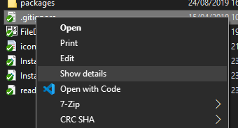
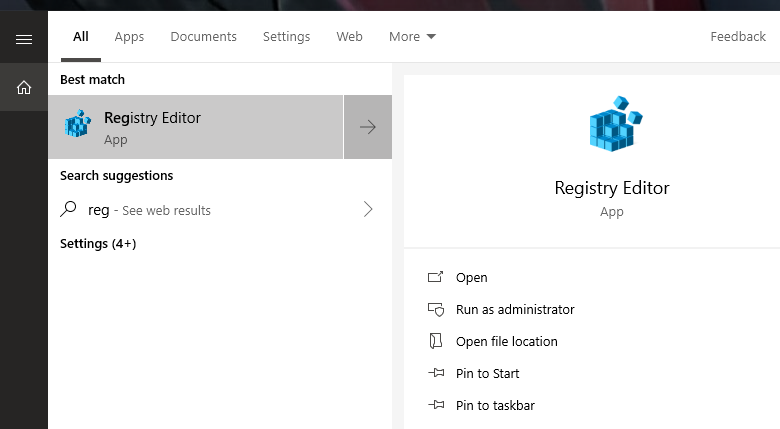

# FileDetails

**Content**
<!-- TOC -->

- [General](#general)
- [Installation](#installation)
    - [Regedit](#regedit)
    - [Registry file](#registry-file)
        - [Registry file for the file menu](#registry-file-for-the-file-menu)
        - [Registry file for the directory menu](#registry-file-for-the-directory-menu)

<!-- /TOC -->

## General
The program *FileDetails* is a small tool to show informations about a file or a directory via the windows context menu (shell).

**File**




When you're showing the details for a file you can also compare the hash values. For this click on the *Compare hash values* button (bottom left)


> **Note** The comparision of the hash values is case insensitive 

**Directory**


You can also save the details into a file (text of markdown) or copy them to the clipboard (text or markdown)

## Installation
When you've compiled the project you can copy the exe to any folder you want. To use the program via the windows context menu (shell) you have to add two entries to the registry.

### Regedit
> **Note**: You need administrator privileges to open the *Registry Editor*

To add a new entry you've to do the following:
1. Open the windows registry:
    1. Press the windows key (keyboard) or click on the symbol in the task bar
    2. Type `regedit` 

       

2. Add the key for files:
    1. Navigate to `HKEY_CLASSES_ROOT\*\shell`
    2. Right click on `shell` and select *New > Key*

       

    3. Give the key the name you want. The name will be displayed in the context menu. I've named it *FileDetails*
    4. Add another key under the new key and name it `command`

       

    5. Right click the entry `(Default)` and select *Modify*

       

    6. Insert the path to the program and add `%1` to the end and click *OK*

       

    7. Now you will see the entry in the context menu

       
3. Add the key for directories:
    1. Navigate to `HKEY_CLASSES_ROOT\Directory\shell`
    2. Perform the steps 2.2 - 2.6

       

    3. Now you will see the entry in the context menu

       

### Registry file
If you don't want to perform all the above steps you can create two small files to add the values directly.

#### Registry file for the file menu
Create a new empty text file and copy the following. Save the file with the extension `reg` (e.G. *FileDetailsInstall.reg*)
```
Windows Registry Editor Version 5.00

[HKEY_CLASSES_ROOT\*\shell\Show details]

[HKEY_CLASSES_ROOT\*\shell\Show details\command]
@="PathToTheExe %1"
```

> **Note**: You have to change the path to the exe

#### Registry file for the directory menu
```
Windows Registry Editor Version 5.00

[HKEY_CLASSES_ROOT\Directory\shell\Show details]

[HKEY_CLASSES_ROOT\Directory\shell\Show details\command]
@="PathToTheExe %1"
```

> **Note**: You have to change the path to the exe
