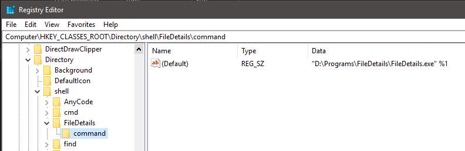

# FileDetails

**Content**
<!-- TOC -->

- [General](#general)
- [Installation](#installation)
    - [Step by step](#step-by-step)
    - [Registry file](#registry-file)
        - [Registry file for the file menu](#registry-file-for-the-file-menu)
        - [Registry file for the directory menu](#registry-file-for-the-directory-menu)

<!-- /TOC -->

## General
The program *FileDetails* is a small tool to show informations about a file or a directory via the windows context menu (shell).


## Installation
When you've compiled the project you can copy the exe to any folder you want. To use the program via the windows context menu (shell) you have to add two entries to the registry.

### Step by step
To add a new entry you've to do the following:
1. Open the windows registry:
    1. Press the windows key or click on the symbol in the task bar
    2. Type `regedit` 

       

2. Add the key for files:
    1. Navigate to `HKEY_CLASSES_ROOT\*\shell`
    2. Right click on `shell` and select *New > Key*

       

    3. Give the key the name you want. The name will be displayed in the context menu. I've named it *FileDetails*
    4. Add another key under the new key and name it `command`

       

    5. Right click the entry `(Default)` and select *Modify*

       

    6. Insert the path to the program and add `%1` to the end and click *OK*

       

    7. Now you will see the entry in the context menu

       
3. Add the key for directories:
    1. Navigate to `HKEY_CLASSES_ROOT\Directory\shell`
    2. Perform the steps 2.2 - 2.6

       

    3. Now you will see the entry in the context menu

       

### Registry file
If you don't want to perform all the above steps you can create two small files to add the values directly.

#### Registry file for the file menu
Create a new empty text file and copy the following. Save the file with the exteions `reg` (e.G. *FileDetailsInstall.reg*)
```
Windows Registry Editor Version 5.00

[HKEY_CLASSES_ROOT\*\shell\FileDetails]

[HKEY_CLASSES_ROOT\*\shell\FileDetails\command]
@="PathToTheExe %1"
```

**Example**
```
Windows Registry Editor Version 5.00

[HKEY_CLASSES_ROOT\*\shell\FileDetails]

[HKEY_CLASSES_ROOT\*\shell\FileDetails\command]
@="D:\\Programs\\FileDetails\\FileDetails.exe %1"
```

#### Registry file for the directory menu
```
Windows Registry Editor Version 5.00

[HKEY_CLASSES_ROOT\Directory\shell\FileDetails]

[HKEY_CLASSES_ROOT\Directory\shell\FileDetails\command]
@="PathToTheExe %1"
```
